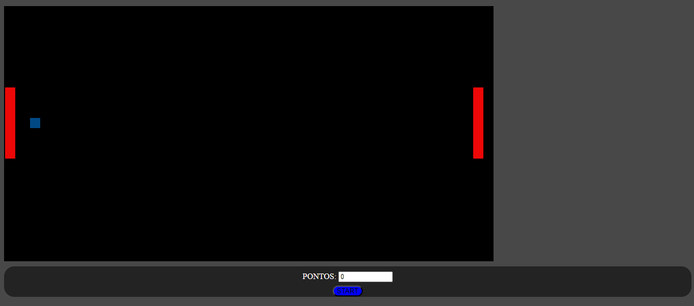

# JOGO DO PING PONG
👨‍💻JOGO DO PING PONG COM HTML, CSS E JS.

  

## DESCRIÇÃO:
**"Ping Pong"** é um jogo de esportes baseado em uma versão simples do ping pong, onde você controla uma barra para rebater uma bola contra um adversário controlado pela máquina. O objetivo é evitar que a bola passe pela sua barra enquanto tenta marcar pontos contra o adversário.

## FUNCIONALIDADES:
1. **Controles**:
   - **Movimento do Jogador**: Use as teclas de seta para cima (`↑`) e para baixo (`↓`) para mover a barra do jogador (barra azul) para cima e para baixo.
   - **Movimento da CPU**: A barra da CPU (barra vermelha) se move automaticamente para tentar rebater a bola.

2. **Objetivo do Jogo**:
   - O objetivo é manter a bola no campo de jogo e evitar que ela passe pela sua barra.
   - Sempre que a bola passa pela barra da CPU, você marca um ponto.
   - Sempre que a bola passa pela sua barra, a CPU marca um ponto.
   
3. **Marcação de Pontos**:
   - O painel de pontos exibe a quantidade atual de pontos do jogador.

4. **Início do Jogo**:
   - Clique no botão "START" para iniciar o jogo. O jogo começará com a bola e as barras nas posições iniciais, e a bola se moverá em uma direção aleatória.

## JOGANDO:
1. **Iniciar o Jogo**:
   - Clique no botão "START" no painel para começar a partida.

2. **Mover a Barra do Jogador**:
   - Use as teclas de seta para cima e para baixo para controlar a barra azul.
   - Mova a barra para tentar rebater a bola e evitar que ela passe pela sua barra.

3. **Objetivo**:
   - Rebata a bola para marcar pontos e evite que a bola passe pela sua barra para não perder pontos.
   - O jogo continua até que você decida começar uma nova partida clicando no botão "START" novamente.

## NÃO SABE?
- Entendemos que para manipular arquivos em `HTML`, `CSS` e outras linguagens relacionadas, é necessário possuir conhecimento nessas áreas. Para auxiliar nesse aprendizado, oferecemos cursos gratuitos disponíveis:
* [CURSO DE HTML E CSS](https://github.com/VILHALVA/CURSO-DE-HTML-E-CSS)
* [CURSO DE JAVASCRIPT](https://github.com/VILHALVA/CURSO-DE-JAVASCRIPT)
* [CURSO DE CANVAS](https://github.com/VILHALVA/CURSO-DE-CANVAS)
* [CONFIRA MAIS CURSOS](https://github.com/VILHALVA?tab=repositories&q=+topic:CURSO)

## CREDITOS:
- [PROJETO CRIADO PELO "KlistenesLima"](https://github.com/KlistenesLima/Jogo-do-PingPong)
- [PROJETO EDITADO PELO VILHALVA](https://github.com/VILHALVA)
